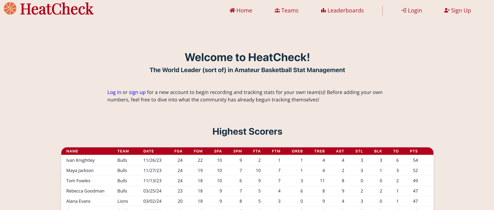
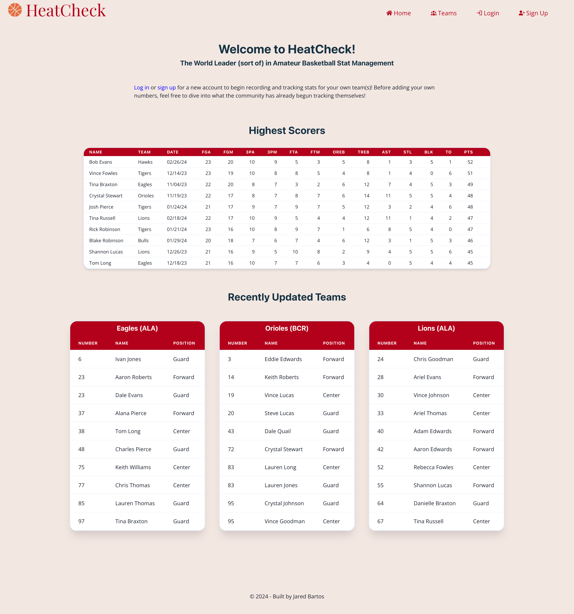
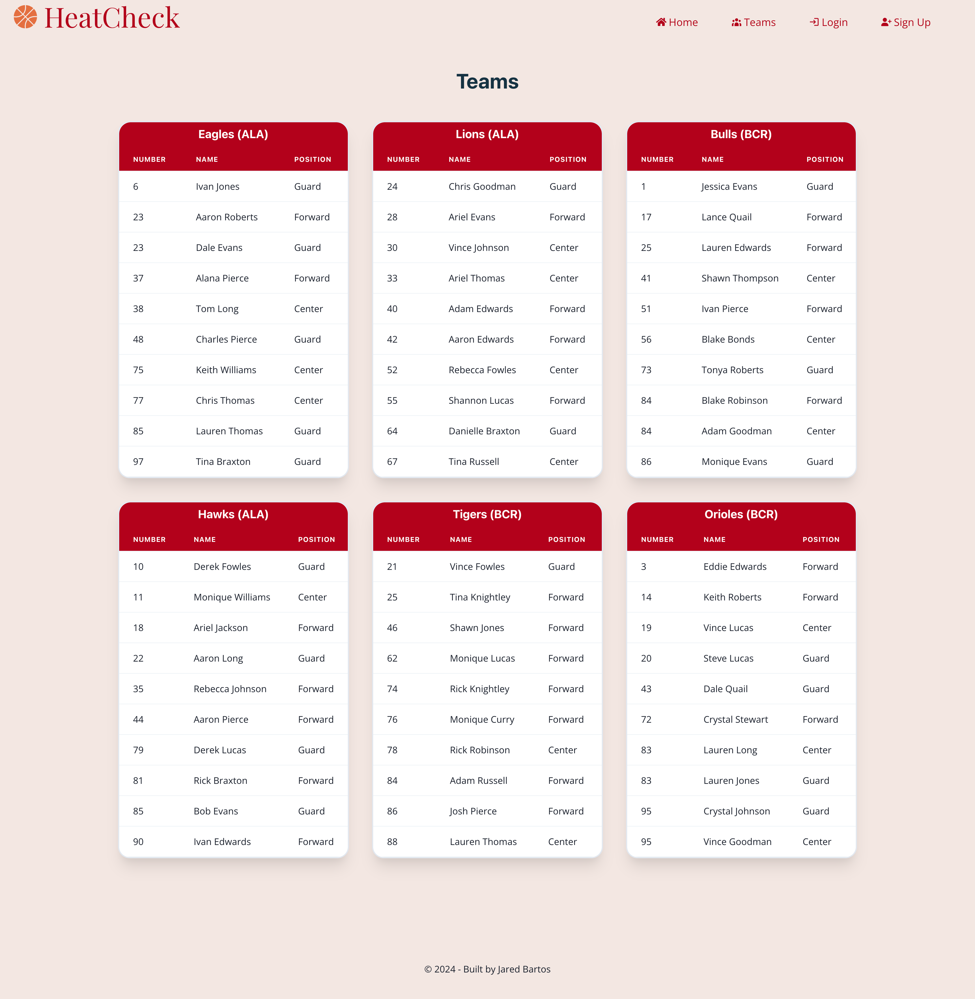
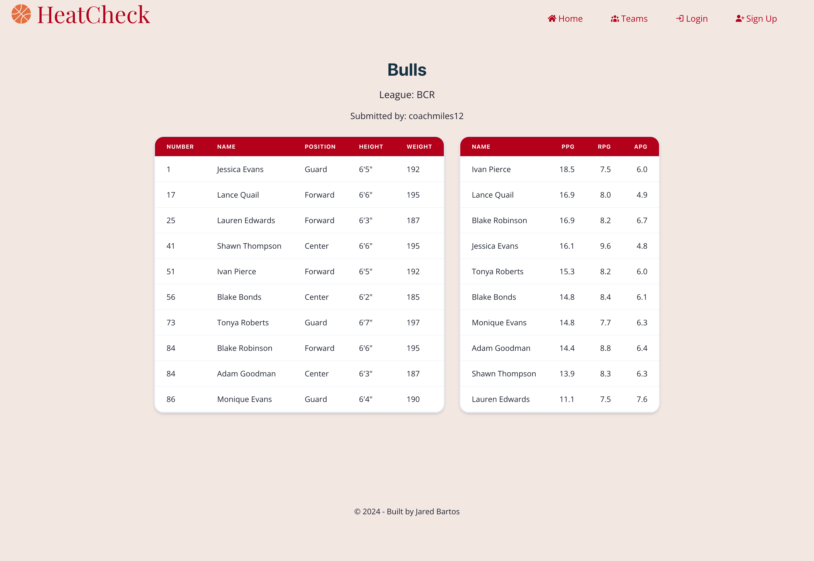
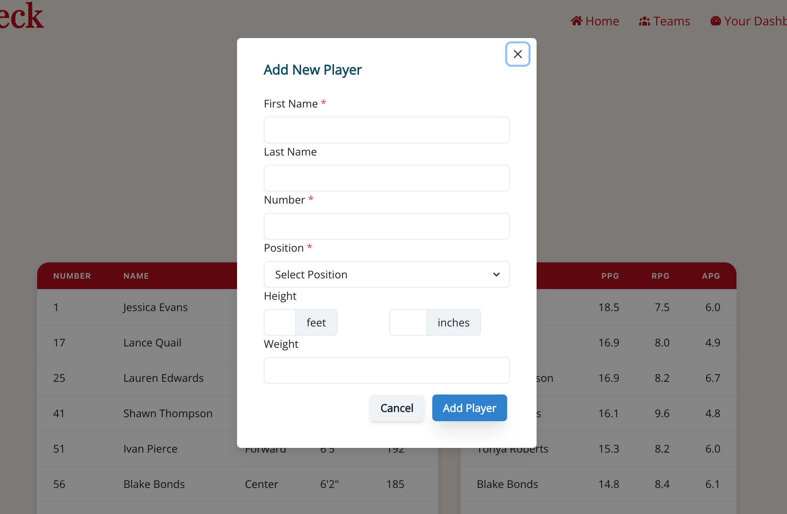
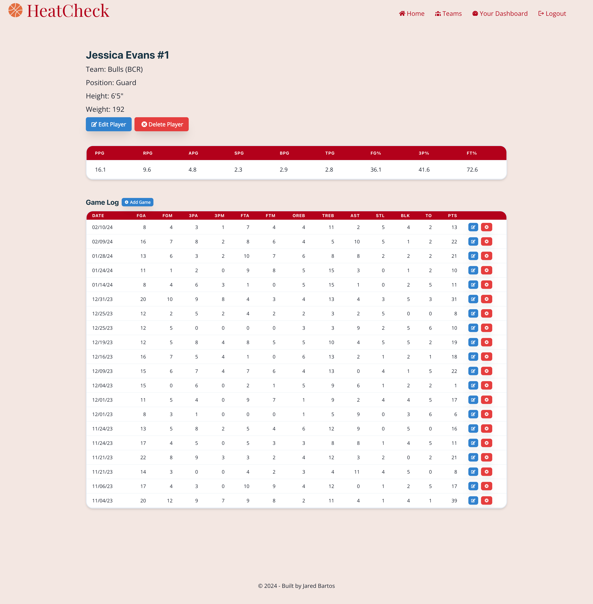
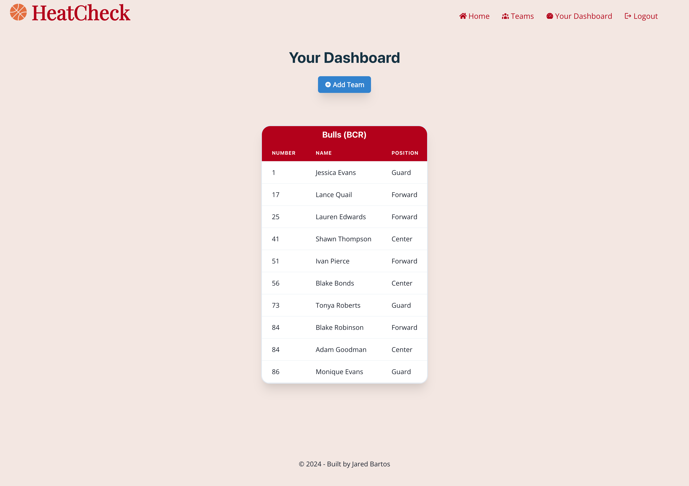

# HeatCheck

## Link to App

[HeatCheck](https://heatcheck.onrender.com/)

## Description

HeatCheck is a basketball team stat management app intended to be used by recreational and amateur league teams. It has a focus on community contribution
by allowing users to view what others have submitted for their own teams, but also a focus on secure record-keeping by only allowing the creators of the teams to edit the existing data and add new players. Head on over to [HeatCheck](https://heatcheck.onrender.com/) to start keeping track of your teams' stats with ease!

## Table of Contents
- [Technologies](#technologies)
- [Requirements](#requirements)
- [Installation](#installation)
- [Usage](#usage)
- [License](#license)
- [Questions](#questions)
- [Screenshots](#screenshots)

## Technologies
- Node.js
- React.js
- Express.js
- GraphQL
- MongoDB
- JWT
- Apollo
- Redux

## Requirements

Any Web Browser

## Installation

No installation needed.

## Usage

HeatCheck was designed to be easy to navigate and quick to use. There aren't any hoops (no pun intended) you have to jump through to start your statistical management journey. When you first visit the link,
you are taken to the homepage where you can browse the recent achievements of other users who have entered their team and player info. There is also a section dedicated to the most recent updates that have been
made to teams by users.

Get started contributing and tracking your own stats by first signing up, or logging in, using the links on the homepage or in the navigation. Once logged in,
you can start by adding a new team on your Dashboard page. By adding your team's name and the league it belongs to, you are now able to add players to that team
and game logs to those players by going to the corresponding pages after you create the entries! You can add as many teams as you need to. There is no limit.

Worried about other users mucking up your stats and ruining your records? Don't be! The only one allowed to edit a team, or its players (game logs included), 
is the user who created it. Everyone else can only gaze at your teams' stats and be jealous!

## License

This application is covered under MIT License.

Please refer to the LICENSE file in repo for more information.

## Questions

My GitHub profile: https://github.com/jaredbartos

If you have any further questions, please contact me through email.

jaredbartos@gmail.com

## Screenshots

### App Interface Before Logging In

### App Interface When Logged In

